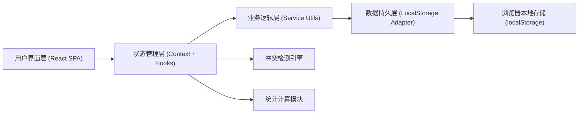
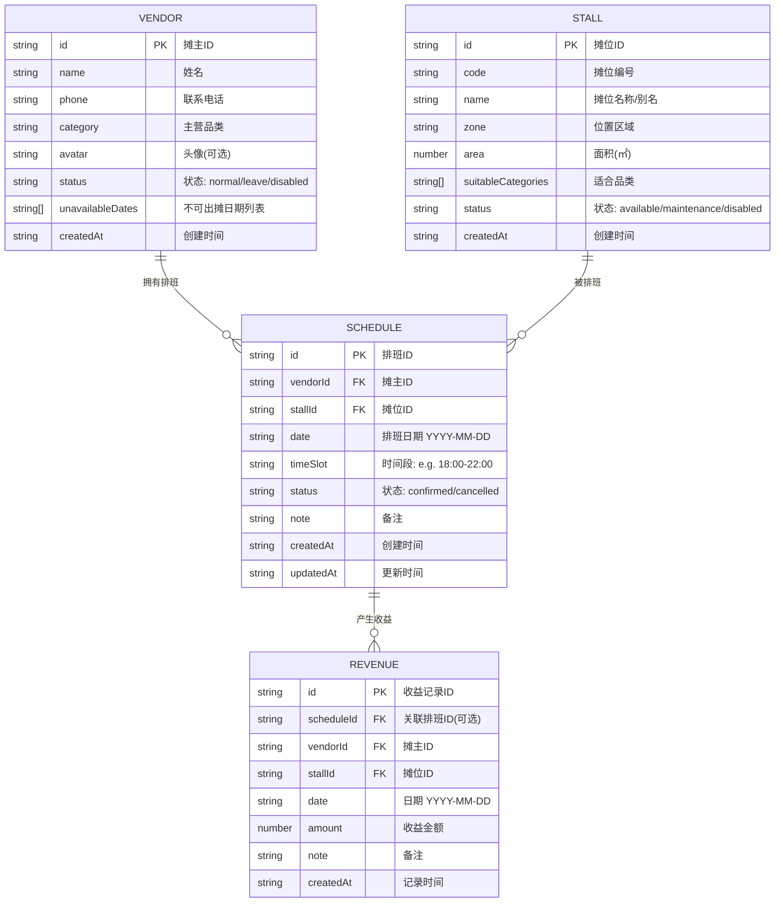

## 1. 架构设计



## 2. 技术说明
- **前端框架**: React@18 + TypeScript
- **构建工具**: Vite@5
- **样式方案**: TailwindCSS@3 + CSS变量（主题定制）
- **路由管理**: React Router@6
- **状态管理**: React Context (AppContext) + useReducer
- **数据持久化**: localStorage（封装 Adapter 模拟"本地文件"，支持 JSON 导入/导出）
- **图标库**: Lucide React（轻量、现代风格）
- **日期处理**: date-fns（轻量级日期工具库）
- **图表方案**: 纯 CSS + SVG 自绘图表（避免引入重型图表库）

## 3. 路由定义
| 路由路径 | 页面组件 | 用途 |
|---------|---------|------|
| / | Dashboard | 仪表盘：今日概览、冲突预警、收益趋势 |
| /vendors | VendorList | 摊主管理：列表、新增、编辑、删除 |
| /stalls | StallList | 摊位管理：网格展示、增删改查 |
| /schedule | ScheduleCalendar | 排班管理：日历视图、排班申请与调整 |
| /conflicts | ConflictCenter | 冲突中心：集中查看和处理所有冲突 |
| /revenue | RevenuePage | 收益管理：录入、统计、报表 |

## 4. 数据模型

### 4.1 实体关系图


### 4.2 数据存储结构 (localStorage keys)
```
night_market_vendors    → Vendor[]  (摊主数据)
night_market_stalls     → Stall[]   (摊位数据)
night_market_schedules  → Schedule[](排班记录)
night_market_revenues   → Revenue[] (收益记录)
night_market_settings   → Settings  (系统设置)
```

### 4.3 冲突检测规则
1. **摊位冲突**: 同一摊位 + 同一日期 + 同一时间段 → 被多个排班占用
2. **摊主冲突**: 同一摊主 + 同一日期 → 被分配到多个摊位（除非时间段完全不重叠）
3. **摊主不可出摊**: 排班日期落在摊主的 `unavailableDates` 中
4. **摊主状态异常**: 摊主状态为 `disabled` 时不能排班
5. **摊位状态异常**: 摊位状态为 `maintenance` 或 `disabled` 时不能排班

## 5. 目录结构
```
src/
├── assets/              # 静态资源
├── components/          # 公共组件
│   ├── ui/             # 基础UI组件 (Button, Card, Modal, Input...)
│   ├── layout/         # 布局组件 (Sidebar, Header...)
│   └── shared/         # 业务公共组件 (ConflictBadge, TimeSlotPicker...)
├── context/            # React Context
│   └── AppContext.tsx  # 全局状态
├── hooks/              # 自定义Hooks
│   ├── useVendors.ts
│   ├── useStalls.ts
│   ├── useSchedules.ts
│   ├── useRevenue.ts
│   └── useConflictDetection.ts
├── pages/              # 页面组件
│   ├── Dashboard.tsx
│   ├── VendorList.tsx
│   ├── StallList.tsx
│   ├── ScheduleCalendar.tsx
│   ├── ConflictCenter.tsx
│   └── RevenuePage.tsx
├── services/           # 业务逻辑服务层
│   ├── storage.ts      # localStorage 封装
│   ├── vendorService.ts
│   ├── stallService.ts
│   ├── scheduleService.ts
│   ├── revenueService.ts
│   └── conflictService.ts
├── types/              # TypeScript 类型定义
│   └── index.ts
├── utils/              # 工具函数
│   ├── dateUtils.ts
│   ├── idGenerator.ts
│   └── exportImport.ts # JSON导入导出
├── styles/             # 全局样式 & 主题
│   └── globals.css
├── App.tsx
├── main.tsx
└── router.tsx
```
