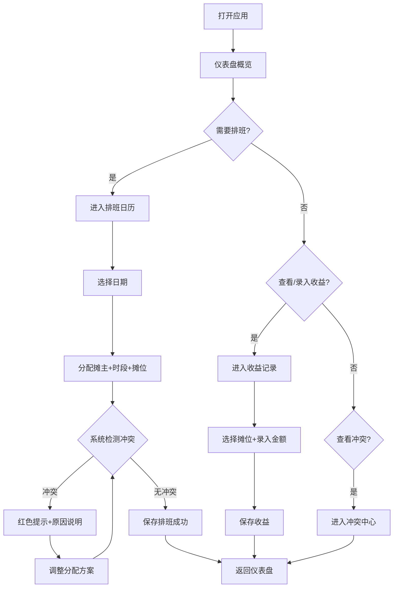

## 1. 产品概述
夜市摊位排班器是一款面向夜市管理者的本地Web应用，用于高效管理摊位资源、摊主排班、冲突检测与收益记录。
- 解决手工排班混乱、摊位冲突难以发现、收益记录零散等问题
- 目标用户：夜市老板/运营管理者，无需复杂培训即可上手

## 2. 核心特性

### 2.1 功能模块
1. **仪表盘**：今日排班总览、冲突预警、本周收益趋势、快捷操作入口
2. **摊主管理**：摊主信息增删改查、联系方式、主营品类、请假/禁用标记
3. **摊位管理**：摊位编号、位置、面积、状态（可用/维修/停用）、适合品类
4. **排班管理**：日历视图排班、申请摊位、调整排班、时间段分配、实时冲突检测
5. **冲突中心**：集中查看所有摊位冲突、摊主重复排班、状态异常等
6. **收益记录**：按摊位/摊主/日期记录当日收益、统计报表、导出数据

### 2.2 页面详情
| 页面名称 | 模块名称 | 功能描述 |
|---------|---------|---------|
| 仪表盘 | 数据概览卡片 | 今日摊位数、在营摊主数、今日预估收益、待处理冲突数 |
| 仪表盘 | 今日排班时间轴 | 按时间段展示今日所有摊位的占用情况 |
| 仪表盘 | 冲突预警面板 | 红色醒目标记当前存在的排班冲突，点击跳转详情 |
| 仪表盘 | 本周收益趋势 | 柱状图展示近7天每日收益 |
| 摊主管理 | 摊主列表 | 搜索、筛选、分页展示所有摊主信息 |
| 摊主管理 | 新增/编辑摊主 | 姓名、电话、主营品类、头像、状态（正常/请假/停用） |
| 摊位管理 | 摊位网格 | 卡片式展示所有摊位，颜色区分状态 |
| 摊位管理 | 新增/编辑摊位 | 编号、名称、位置区域、面积、适合品类、状态 |
| 排班管理 | 日历视图 | 月历/周历切换，点击日期进入当日排班 |
| 排班管理 | 申请摊位表单 | 选择摊主、日期、时间段、摊位，提交前校验冲突 |
| 排班管理 | 调整排班 | 拖拽/编辑已有排班记录，实时检测冲突 |
| 冲突中心 | 冲突列表 | 按类型（摊位冲突/摊主冲突/状态异常）分类展示 |
| 冲突中心 | 冲突详情 | 展示冲突双方信息，提供一键调整入口 |
| 收益记录 | 收益录入 | 按摊位选择，录入当日收益、备注 |
| 收益记录 | 统计报表 | 按日期范围、摊主、摊位多维度统计 |

## 3. 核心流程
用户打开应用 → 在仪表盘查看今日概况 → 进入排班管理选择日期 → 为摊主分配摊位/时间段 → 系统实时检测冲突 → 无冲突则保存成功 → 冲突时高亮提示并给出原因 → 当日结束后录入各摊位收益 → 查看统计报表

## 4. 界面设计

### 4.1 设计风格
- **主色调**：暖橙色系（#FF6B35 主色），呼应夜市烟火气，搭配深炭灰（#2D2A32）背景
- **辅助色**：翠绿（#4CAF50）表示可用/正常，猩红（#E53935）表示冲突/异常，暖金（#FFB300）表示提醒
- **按钮风格**：大圆角（12px）、立体微阴影、悬停微微上浮效果
- **字体**：标题使用"ZCOOL KuaiLe"（中文快乐体，活泼有烟火气），正文使用"Noto Sans SC"
- **布局**：左侧固定导航栏 + 右侧内容区，卡片式模块，带阴影和渐变边框
- **装饰**：卡片角落加霓虹光效描边，模拟夜市霓虹灯氛围

### 4.2 页面设计概览
| 页面名称 | 模块名称 | UI元素 |
|---------|---------|---------|
| 仪表盘 | 数据概览卡片 | 渐变背景卡片，数字大号加粗，右侧配图标，悬停轻微缩放 |
| 仪表盘 | 今日排班时间轴 | 横向时间轴，不同摊位用不同色块，tooltip展示详情 |
| 仪表盘 | 冲突预警面板 | 红色渐变背景，闪烁动画边框，感叹号图标 |
| 摊主管理 | 摊主卡片 | 头像+名字+品类标签，底部状态指示灯 |
| 排班管理 | 日历视图 | 日期格子中用小圆点标记有排班，冲突日标红 |
| 排班管理 | 排班表单 | 下拉选择+日期选择器，冲突字段实时标红 |
| 收益记录 | 统计报表 | 渐变柱状图，鼠标悬停显示具体数值 |

### 4.3 响应式
- 桌面端优先设计（≥1280px）
- 平板端（768-1279px）：导航栏折叠为图标模式，内容区自适应
- 移动端（<768px）：顶部汉堡菜单，卡片单列堆叠，表单全宽
- 所有交互元素保证≥44px触摸区域
